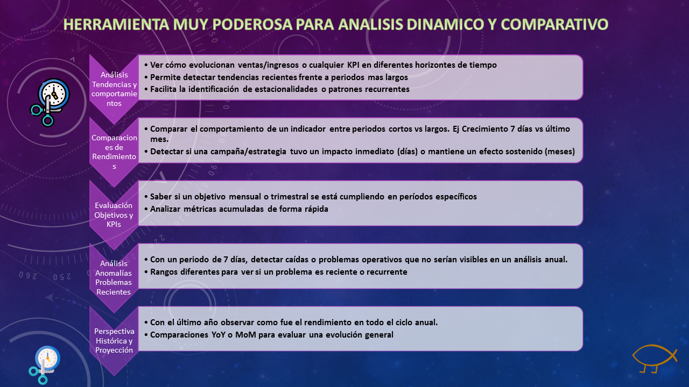
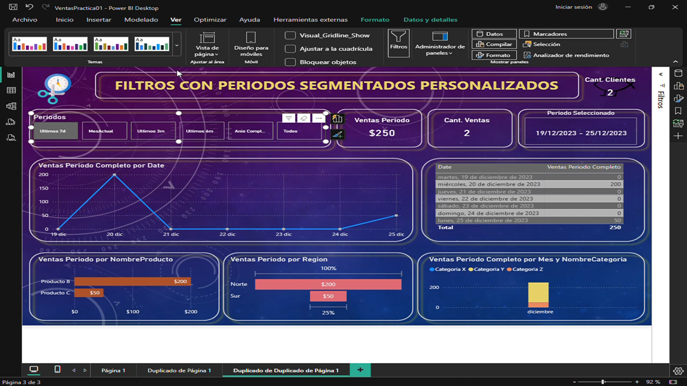

# Ventas Periodos Segmentados PWBI

## 📊 Analisis Ventas en Diferentes Segmentos de Tiempo

Miniproyecto para Analizar Ventas aplicando diferentes segmentos de ventas.
Esto permite medir, comparar y analizar comportamientos, buscando patrones para buscar oportunidades de mejora, 
identificar cambios estacionales y/o detectar cambios rapidamente y aplicar planes de acción para cambiar tendencias.

## 🖼️ Vista previa

## 🚀 Tecnologías
- Microsoft Power BI Desktop
- Fórmulas DAX para segmentar diferentes periodos de tiempo.
- Microsoft Power Point para presentación preliminar del Dashboard.

##### 👨‍💻 Author
###### Gabriel Gallardo
🔗 [LinkedIn Profile](https://www.linkedin.com/in/gerardo-gabriel-gallardo-12619ab5)
